# ADS112C04 使用

- author: hachimi
- date: 2026/7/4

[TOC]

最近在准备一个封闭式的比赛，查到往年的器件有这个高精度的delta-sigma ADC芯片，很适合做一些直流测量，把这个芯片买了试了一试，记录一下

**相关代码**: https://github.com/Kreeli/ADS112C04_Sn-s-resistance-measure

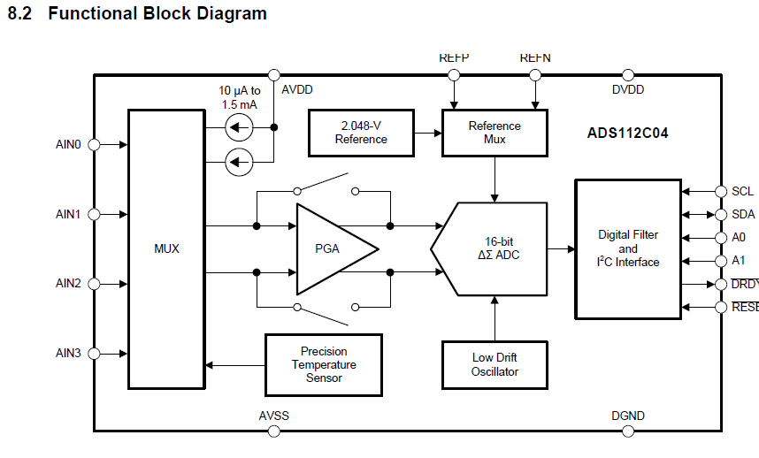

# Driverlib的I2C读写基本函数

先得说说这个Driverlib的代码怎么用，就以AI写的基本读写寄存器函数（包括一个等待应答）为例说明

```C
/* 等待控制器传输完成（空闲） */
static void ADS112C_waitControllerIdle(void)
{
    uint32_t timeout = ADS112C_BUS_TIMEOUT_LOOPS;//一个时间最大值的宏

    while ((DL_I2C_getControllerStatus(I2C_ADS112C) & DL_I2C_CONTROLLER_STATUS_IDLE) == 0u)
    {
        if (--timeout == 0u)
        {
            /* 总线卡死：复位控制器的传输状态 */
            DL_I2C_resetControllerTransfer(I2C_ADS112C);
            break;
        }
    }
}

/* 向配置寄存器写入一个值（WREG 命令，图 59） */
void ADS112C_writeRegister(uint8_t reg, uint8_t value)
{
    uint8_t txBuffer[2];
    //这是一个函数宏，返回写寄存器需要的指令 0100 rrxx：写地址 rr 处的寄存器
    txBuffer[0] = ADS112C_CMD_WREG(reg);  
    txBuffer[1] = value;

    DL_I2C_fillControllerTXFIFO(I2C_ADS112C, txBuffer, 2u);
    DL_I2C_startControllerTransfer(I2C_ADS112C, ADS112C_I2C_ADDR,
        DL_I2C_CONTROLLER_DIRECTION_TX, 2u);
    ADS112C_waitControllerIdle();
}

/* 读取配置寄存器（RREG 命令，图 58） */
uint8_t ADS112C_readRegister(uint8_t reg)
{
    uint8_t txBuffer;
    uint8_t value = 0u;

    /* 第一帧：发送 RREG 命令 */
    txBuffer = ADS112C_CMD_RREG(reg);  /* 0010 rrxx：读地址 rr 处的寄存器 */
    DL_I2C_fillControllerTXFIFO(I2C_ADS112C, &txBuffer, 1u);
    DL_I2C_startControllerTransfer(I2C_ADS112C, ADS112C_I2C_ADDR,
        DL_I2C_CONTROLLER_DIRECTION_TX, 1u);
    ADS112C_waitControllerIdle();

    /* 第二帧：读取寄存器内容 */
    DL_I2C_startControllerTransfer(I2C_ADS112C, ADS112C_I2C_ADDR,
        DL_I2C_CONTROLLER_DIRECTION_RX, 1u);
    ADS112C_waitControllerIdle();
    value = DL_I2C_receiveControllerData(I2C_ADS112C);

    return value;
}
```
可以注意到，DriverLib是不用单独自己写一遍发送地址的指令，想要I2C发送数据，先得弄一个uint8_t类型的数组，然后把需要发送的数据塞进去，按照顺序**填充TX FIFO -> 设置I2C数据参数方向、地址、数量，开始传输 -> 等待结束**的顺序调用函数，完成I2C数据的发送。

函数分别是
```C
DL_I2C_fillControllerTXFIFO(I2C_ADS112C, txBuffer, 2u);//从数据源填充数据到FIFO
DL_I2C_startControllerTransfer(I2C_ADS112C, ADS112C_I2C_ADDR,
    DL_I2C_CONTROLLER_DIRECTION_TX, 2u);//指定I2C外设和数据传输方向，I2C从机地址，传输字节数
ADS112C_waitControllerIdle();
```
ADS112C_waitControllerIdle是检查应答信号的函数，也可以用下面简单的方式

```C
while(DL_I2C_getControllerStatus(I2C_ADS112C) & DL_I2C_CONTROLLER_STATUS_IDLE == 0u)
    continue;   
```
这样可以等到I2C数据传输完成，非常安全，如果怕超时，可以像上面那样加个防止超时的东西

按照I2C协议，读数据的顺序是，
start->呼叫从机地址(W),ACK->写指令(读取寄存器命令),ACK
->第二次start->呼叫从机地址(R),ACK->读,ACK->stop
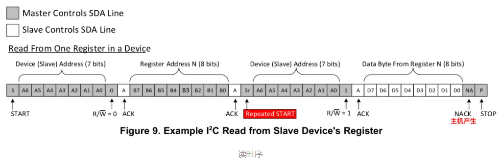
这个我总是忘，所以贴这里复习一下
用的函数还是原来的一套，可以调回去再看一遍AI的读函数怎么写的

# 这芯片怎么采电压?

这个芯片有两个采集模式，连续模式和单次模式，顾名思义，在连续模式下，ADC一直自动转换，每次I2C读数据都是读取最新的转换结果。单次模式下，每次转换前都要重新发送一次转换指令0x08，这一般都是为了低功耗之类的，我们这里不用，就用连续模式

这个芯片有一个可编程的PGA，类似仪表放大器，增益高达128，只有在差分输入的时候才能用。这个PGA可以禁用，但是增益只能到4。正如芯片手册第一面，这个功能适合配合电阻全桥类型的传感器。

此外，这个芯片还能设置一个10uA到1500uA的电流源，很适合用四线法测小电阻，甚至还能校准ADC自身，不过测试之后感觉没啥用

本节以增益为1、PGA禁用、使能Ain0和GND、AVDD参考、3.3-0V供电为例，进行配置
```C
void ADS112C_quickInit(void)
{
    /* 复位器件到默认状态（所有寄存器 = 00h） */
    ADS112C_sendCommand(ADS112C_CMD_RESET);

    /* CFG0：AINP = AIN0, AINN = AVSS（单端），增益 = 1，PGA 旁路 */
    ADS112C_writeRegister(ADS112C_REG_CFG0,
        ADS112C_CFG0_MUX_AIN0_AVSS |
        ADS112C_CFG0_GAIN_1 |
        ADS112C_CFG0_PGA_BYPASS);

    /* CFG1：turbo 模式 (660 SPS)、连续转换、AVDD 基准 */
    ADS112C_writeRegister(ADS112C_REG_CFG1,
        ADS112C_CFG1_DR_330SPS |
        ADS112C_CFG1_MODE_TURBO |
        ADS112C_CFG1_CM_CONTINUOUS |
        ADS112C_CFG1_VREF_AVDD |
        ADS112C_CFG1_TS_DISABLE);

    /* CFG2、CFG3：复位后均为默认值 0（DRDY 标志、IDAC 关闭等） */

    /* 启动连续转换（设置 CM = continuous 后必须发送一次 START/SYNC） */
    ADS112C_sendCommand(ADS112C_CMD_START_SYNC);
}
```

宏定义是（很长，其实我不是很想放在这，我还是希望读者把我的工程下下来看一下这个文件，然后爆改一下）
```C
#define ADS112C_I2C_ADDR  (0x40u)  /* A1/A0 接 DGND，默认地址 */

/* ---------------------------------------------------------------------------
 * 寄存器地址
 * ------------------------------------------------------------------------- */
#define ADS112C_REG_CFG0                (0x00u)  /* 配置寄存器 0 */
#define ADS112C_REG_CFG1                (0x01u)  /* 配置寄存器 1 */
#define ADS112C_REG_CFG2                (0x02u)  /* 配置寄存器 2 */
#define ADS112C_REG_CFG3                (0x03u)  /* 配置寄存器 3 */

/* ---------------------------------------------------------------------------
 * 命令 (表 16) - rr = 寄存器地址，x = 任意值
 * ------------------------------------------------------------------------- */
#define ADS112C_CMD_RESET               (0x06u)  /* 0000 011x 复位器件 */
#define ADS112C_CMD_START_SYNC          (0x08u)  /* 0000 100x 启动/重新启动转换 */
#define ADS112C_CMD_POWERDOWN           (0x02u)  /* 0000 001x 进入掉电模式 */
#define ADS112C_CMD_RDATA               (0x10u)  /* 0001 xxxx 按命令读取数据 */
#define ADS112C_CMD_RREG(reg)           (0x20u | ((reg) << 2))  /* 0010 rrxx 读取地址 rr 处的寄存器 */
#define ADS112C_CMD_WREG(reg)           (0x40u | ((reg) << 2))  /* 0100 rrxx 写入地址 rr 处的寄存器 */

/* ---------------------------------------------------------------------------
 * 配置寄存器 0 (00h) - 复位值 00h
 * ------------------------------------------------------------------------- */

/* 位掩码 */
#define ADS112C_CFG0_MUX_MASK           (0xF0u)  /* 位 7:4 输入多路复用器 */
#define ADS112C_CFG0_GAIN_MASK          (0x0Eu)  /* 位 3:1 增益 */
#define ADS112C_CFG0_PGA_BYPASS_MASK    (0x01u)  /* 位 0  PGA 旁路 */

/* MUX[3:0] - 输入多路复用器配置 (表 19) */
#define ADS112C_CFG0_MUX_AIN0_AIN1      (0x00u)  /* AINP = AIN0, AINN = AIN1 (默认) */
#define ADS112C_CFG0_MUX_AIN0_AIN2      (0x10u)  /* AINP = AIN0, AINN = AIN2 */
#define ADS112C_CFG0_MUX_AIN0_AIN3      (0x20u)  /* AINP = AIN0, AINN = AIN3 */
#define ADS112C_CFG0_MUX_AIN1_AIN0      (0x30u)  /* AINP = AIN1, AINN = AIN0 */
#define ADS112C_CFG0_MUX_AIN1_AIN2      (0x40u)  /* AINP = AIN1, AINN = AIN2 */
#define ADS112C_CFG0_MUX_AIN1_AIN3      (0x50u)  /* AINP = AIN1, AINN = AIN3 */
#define ADS112C_CFG0_MUX_AIN2_AIN3      (0x60u)  /* AINP = AIN2, AINN = AIN3 */
#define ADS112C_CFG0_MUX_AIN3_AIN2      (0x70u)  /* AINP = AIN3, AINN = AIN2 */
#define ADS112C_CFG0_MUX_AIN0_AVSS      (0x80u)  /* AINP = AIN0, AINN = AVSS (单端) */
#define ADS112C_CFG0_MUX_AIN1_AVSS      (0x90u)  /* AINP = AIN1, AINN = AVSS (单端) */
#define ADS112C_CFG0_MUX_AIN2_AVSS      (0xA0u)  /* AINP = AIN2, AINN = AVSS (单端) */
#define ADS112C_CFG0_MUX_AIN3_AVSS      (0xB0u)  /* AINP = AIN3, AINN = AVSS (单端) */
#define ADS112C_CFG0_MUX_REF_MON        (0xC0u)  /* (V(REFP) - V(REFN)) / 4 监测 (PGA 旁路) */
#define ADS112C_CFG0_MUX_AVDD_MON       (0xD0u)  /* (AVDD - AVSS) / 4 监测 (PGA 旁路) */
#define ADS112C_CFG0_MUX_MID_SUPPLY     (0xE0u)  /* AINP 与 AINN 短接至 (AVDD + AVSS) / 2 */
                                                 /* 0xF0 = 保留 */

/* GAIN[2:0] - 增益配置 (表 19) */
#define ADS112C_CFG0_GAIN_1             (0x00u)  /* 增益 = 1 (默认) */
#define ADS112C_CFG0_GAIN_2             (0x02u)  /* 增益 = 2 */
#define ADS112C_CFG0_GAIN_4             (0x04u)  /* 增益 = 4 */
#define ADS112C_CFG0_GAIN_8             (0x06u)  /* 增益 = 8 */
#define ADS112C_CFG0_GAIN_16            (0x08u)  /* 增益 = 16 */
#define ADS112C_CFG0_GAIN_32            (0x0Au)  /* 增益 = 32 */
#define ADS112C_CFG0_GAIN_64            (0x0Cu)  /* 增益 = 64 */
#define ADS112C_CFG0_GAIN_128           (0x0Eu)  /* 增益 = 128 */

/* PGA_BYPASS - 位 0 */
#define ADS112C_CFG0_PGA_ENABLED        (0x00u)  /* PGA 使能 (默认) */
#define ADS112C_CFG0_PGA_BYPASS         (0x01u)  /* PGA 禁用并旁路 */

/* ---------------------------------------------------------------------------
 * 配置寄存器 1 (01h) - 复位值 00h
 * ------------------------------------------------------------------------- */

/* 位掩码 */
#define ADS112C_CFG1_DR_MASK            (0xE0u)  /* 位 7:5 数据速率 */
#define ADS112C_CFG1_MODE_MASK          (0x10u)  /* 位 4  工作模式 */
#define ADS112C_CFG1_CM_MASK            (0x08u)  /* 位 3  转换模式 */
#define ADS112C_CFG1_VREF_MASK          (0x06u)  /* 位 2:1 电压基准 */
#define ADS112C_CFG1_TS_MASK            (0x01u)  /* 位 0  温度传感器 */

/* DR[2:0] - 数据速率 (表 21) */
#define ADS112C_CFG1_DR_20SPS           (0x00u)  /* 20 SPS  (normal) / 40 SPS  (turbo) (默认) */
#define ADS112C_CFG1_DR_45SPS           (0x20u)  /* 45 SPS  (normal) / 90 SPS  (turbo) */
#define ADS112C_CFG1_DR_90SPS           (0x40u)  /* 90 SPS  (normal) / 180 SPS (turbo) */
#define ADS112C_CFG1_DR_175SPS          (0x60u)  /* 175 SPS (normal) / 350 SPS (turbo) */
#define ADS112C_CFG1_DR_330SPS          (0x80u)  /* 330 SPS (normal) / 660 SPS (turbo) */
#define ADS112C_CFG1_DR_600SPS          (0xA0u)  /* 600 SPS (normal) / 1200 SPS (turbo) */
#define ADS112C_CFG1_DR_1000SPS         (0xC0u)  /* 1000 SPS (normal) / 2000 SPS (turbo) */
                                                 /* 0xE0 = 保留 */

/* MODE - 位 4 */
#define ADS112C_CFG1_MODE_NORMAL        (0x00u)  /* 正常模式，256-kHz 调制器时钟 (默认) */
#define ADS112C_CFG1_MODE_TURBO         (0x10u)  /* Turbo 模式，512-kHz 调制器时钟 */

/* CM - 位 3 */
#define ADS112C_CFG1_CM_SINGLE_SHOT     (0x00u)  /* 单次转换模式 (默认) */
#define ADS112C_CFG1_CM_CONTINUOUS      (0x08u)  /* 连续转换模式 */

/* VREF[1:0] - 位 2:1，电压基准选择 (表 20) */
#define ADS112C_CFG1_VREF_INTERNAL      (0x00u)  /* 内部 2.048-V 基准 (默认) */
#define ADS112C_CFG1_VREF_EXTERNAL      (0x02u)  /* 外部基准 (REFP 至 REFN) */
#define ADS112C_CFG1_VREF_AVDD          (0x04u)  /* 模拟电源 (AVDD - AVSS) 作基准 */
#define ADS112C_CFG1_VREF_AVDD2         (0x06u)  /* 模拟电源 (AVDD - AVSS) 作基准 */

/* TS - 位 0，温度传感器模式 */
#define ADS112C_CFG1_TS_DISABLE         (0x00u)  /* 温度传感器模式禁用 (默认) */
#define ADS112C_CFG1_TS_ENABLE          (0x01u)  /* 温度传感器模式使能 */

/* ---------------------------------------------------------------------------
 * 配置寄存器 2 (02h) - 复位值 00h
 * ------------------------------------------------------------------------- */

/* 位掩码 */
#define ADS112C_CFG2_DRDY_MASK          (0x80u)  /* 位 7  转换结果就绪标志 (只读) */
#define ADS112C_CFG2_DCNT_MASK          (0x40u)  /* 位 6  数据计数器使能 */
#define ADS112C_CFG2_CRC_MASK           (0x30u)  /* 位 5:4 数据完整性校验 */
#define ADS112C_CFG2_BCS_MASK           (0x08u)  /* 位 3  烧毁检测电流源 */
#define ADS112C_CFG2_IDAC_MASK          (0x07u)  /* 位 2:0 IDAC 电流设置 */

/* DRDY - 位 7 (只读) */
#define ADS112C_CFG2_DRDY_NO_DATA       (0x00u)  /* 无新的转换结果 */
#define ADS112C_CFG2_DRDY_NEW_DATA      (0x80u)  /* 新的转换结果就绪 */

/* DCNT - 位 6，转换数据计数器使能 */
#define ADS112C_CFG2_DCNT_DISABLE       (0x00u)  /* 转换计数器禁用 (默认) */
#define ADS112C_CFG2_DCNT_ENABLE        (0x40u)  /* 转换计数器使能 */

/* CRC[1:0] - 位 5:4，数据完整性校验 */
#define ADS112C_CFG2_CRC_DISABLE        (0x00u)  /* 禁用 (默认) */
#define ADS112C_CFG2_CRC_INVERT         (0x10u)  /* 数据反相输出使能 */
#define ADS112C_CFG2_CRC_CRC16          (0x20u)  /* CRC16 使能 */
                                                 /* 0x30 = 保留 */

/* BCS - 位 3，烧毁检测电流源 (10 uA) */
#define ADS112C_CFG2_BCS_OFF            (0x00u)  /* 电流源关闭 (默认) */
#define ADS112C_CFG2_BCS_ON             (0x08u)  /* 电流源打开 */

/* IDAC[2:0] - 位 2:0，IDAC1/IDAC2 激励电流设置 (表 22) */
#define ADS112C_CFG2_IDAC_OFF           (0x00u)  /* 关闭 (默认) */
#define ADS112C_CFG2_IDAC_10UA          (0x01u)  /* 10 uA */
#define ADS112C_CFG2_IDAC_50UA          (0x02u)  /* 50 uA */
#define ADS112C_CFG2_IDAC_100UA         (0x03u)  /* 100 uA */
#define ADS112C_CFG2_IDAC_250UA         (0x04u)  /* 250 uA */
#define ADS112C_CFG2_IDAC_500UA         (0x05u)  /* 500 uA */
#define ADS112C_CFG2_IDAC_1000UA        (0x06u)  /* 1000 uA */
#define ADS112C_CFG2_IDAC_1500UA        (0x07u)  /* 1500 uA */

/* ---------------------------------------------------------------------------
 * 配置寄存器 3 (03h) - 复位值 00h
 * ------------------------------------------------------------------------- */

/* 位掩码 */
#define ADS112C_CFG3_I1MUX_MASK         (0xE0u)  /* 位 7:5 IDAC1 路由 */
#define ADS112C_CFG3_I2MUX_MASK         (0x1Cu)  /* 位 4:2 IDAC2 路由 */
                                                 /* 位 1:0 保留，始终写 0 */

/* I1MUX[2:0] - 位 7:5，IDAC1 路由配置 (表 23) */
#define ADS112C_CFG3_I1MUX_DISABLE      (0x00u)  /* IDAC1 禁用 (默认) */
#define ADS112C_CFG3_I1MUX_AIN0         (0x20u)  /* IDAC1 连接到 AIN0 */
#define ADS112C_CFG3_I1MUX_AIN1         (0x40u)  /* IDAC1 连接到 AIN1 */
#define ADS112C_CFG3_I1MUX_AIN2         (0x60u)  /* IDAC1 连接到 AIN2 */
#define ADS112C_CFG3_I1MUX_AIN3         (0x80u)  /* IDAC1 连接到 AIN3 */
#define ADS112C_CFG3_I1MUX_REFP         (0xA0u)  /* IDAC1 连接到 REFP */
#define ADS112C_CFG3_I1MUX_REFN         (0xC0u)  /* IDAC1 连接到 REFN */
                                                 /* 0xE0 = 保留 */

/* I2MUX[2:0] - 位 4:2，IDAC2 路由配置 (表 23) */
#define ADS112C_CFG3_I2MUX_DISABLE      (0x00u)  /* IDAC2 禁用 (默认) */
#define ADS112C_CFG3_I2MUX_AIN0         (0x04u)  /* IDAC2 连接到 AIN0 */
#define ADS112C_CFG3_I2MUX_AIN1         (0x08u)  /* IDAC2 连接到 AIN1 */
#define ADS112C_CFG3_I2MUX_AIN2         (0x0Cu)  /* IDAC2 连接到 AIN2 */
#define ADS112C_CFG3_I2MUX_AIN3         (0x10u)  /* IDAC2 连接到 AIN3 */
#define ADS112C_CFG3_I2MUX_REFP         (0x14u)  /* IDAC2 连接到 REFP */
#define ADS112C_CFG3_I2MUX_REFN         (0x18u)  /* IDAC2 连接到 REFN */
                                                 /* 0x1C = 保留 */
```

以上是配置，ADC读取数据的方法是
```C
int16_t ADS112C_readData(void)
{
    uint16_t data16 = 0u;
    if (!gConversionContinuous)
    {
        ADS112C_sendCommand(ADS112C_CMD_START_SYNC);
    }

    /* 第一帧：发送 RDATA 命令 */
    ADS112C_sendCommand(ADS112C_CMD_RDATA);
    DL_I2C_startControllerTransfer(I2C_ADS112C, ADS112C_I2C_ADDR,
        DL_I2C_CONTROLLER_DIRECTION_RX, 2u);
    ADS112C_waitControllerIdle();
    *((uint8_t*)&data16 + 1) = DL_I2C_receiveControllerData(I2C_ADS112C);
    ADS112C_waitControllerIdle();
    *((uint8_t*)&data16) = DL_I2C_receiveControllerData(I2C_ADS112C);
    return (int16_t)data16;
}
```
先命令ADS112C04开始转换，然后发送RDATA指令，然后再读取两个字节，就OK了（我贴出来的代码仅仅是部分的）

主函数只用做下面的内容
```C
ADS112C_quickInit();

printf("Hello\n");
ADS112C_configChannel(ADS112C_CFG0_MUX_MID_SUPPLY);
ADS112C_configPGA(true, ADS112C_CFG0_GAIN_128);

while (1) {
    uint16_t data16 = ADS112C_readData();
    printf("data16 = %d\n", data16);
    delay_cycles(8000000);
}
```

主函数里用到的几个`ADS112C_configXxx`封装函数我没贴出来，这里补一下，内部其实就是**读寄存器 -> 改对应位 -> 写回去**三步，以用到的两个为例

```C
/* 配置PGA：第一个参数控制使能/旁路，第二个参数是增益 */
void ADS112C_configPGA(bool pgaEnable, uint8_t gain)
{
    uint8_t reg = ADS112C_readRegister(ADS112C_REG_CFG0);

    /* 增益8~128时芯片强制开PGA，跟旁路位无关 */
    if (gain > ADS112C_CFG0_GAIN_4)
    {
        pgaEnable = true;
    }

    reg &= ~(ADS112C_CFG0_GAIN_MASK | ADS112C_CFG0_PGA_BYPASS_MASK);
    reg |= (gain & ADS112C_CFG0_GAIN_MASK);
    if (!pgaEnable)
    {
        reg |= ADS112C_CFG0_PGA_BYPASS;
    }
    ADS112C_writeRegister(ADS112C_REG_CFG0, reg);
}

/* 配置输入通道（多路复用器），比如换成单端AIN1就传ADS112C_CFG0_MUX_AIN1_AVSS */
void ADS112C_configChannel(uint8_t mux)
{
    uint8_t reg = ADS112C_readRegister(ADS112C_REG_CFG0);

    reg &= ~ADS112C_CFG0_MUX_MASK;
    reg |= (mux & ADS112C_CFG0_MUX_MASK);
    ADS112C_writeRegister(ADS112C_REG_CFG0, reg);
}
```

另外还有配置采样率（参数1连续/单次、参数2 normal/turbo、参数3数据速率）的`ADS112C_configSampleRate`和配置电压基准的`ADS112C_configReference`，都是同一个套路，就不重复贴了，完整代码看文章末尾的Github链接

我的连接非常粗糙，简单用杜邦线连接，连去耦电容都没有，但是结果也很稳定，说明这个芯片还是很强的

设置电压为1.8V，采集的非常稳定
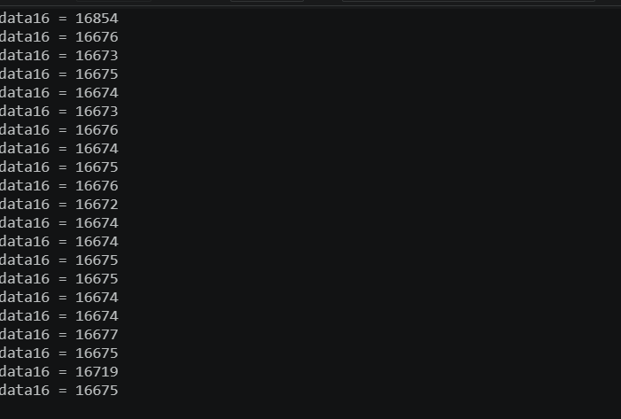

# 四线法测电阻

注意到芯片可以配置电流源，那么就能做一个4线法测电阻

这里也是展示一下传统艺能，测量锡丝的电阻

## 初遇滑铁卢

本人一直以来对自己的基础参数测量技术非常自信，此前也做过两次小电阻的检测，所以这次看到这个ADC集成PGA和电流源，非常的兴奋，这不是小电阻测量一条龙吗?

然后，我迅速的给出了这个简单的电路，在面包板上面搭建。
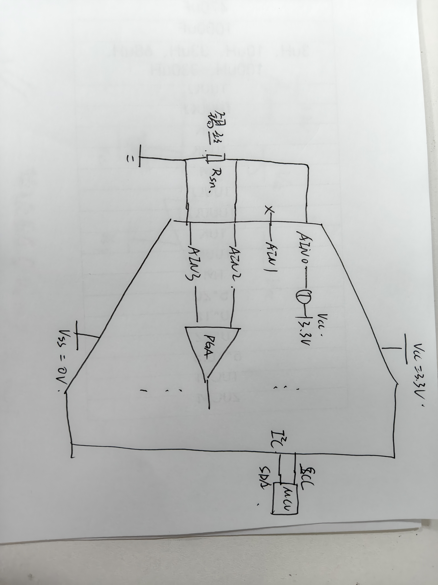
这个电路简简单单，几根杜邦线就能做完，当我兴致勃勃的看测量结果的时候，居然发现，测量结果居然是个负数!?

不信邪，我又接了一个5.1欧姆的电阻，把增益调成2，这次勉强测出来电阻为4.6ohm，与真实值相差甚远。为什么会这样的？ADC是好芯片，通信是好通信，代码也是好代码，哪里搞错了?会不会是增益太小了，然后我把增益从1到128都设置了一遍，结果都打印出来，结果非常诡异
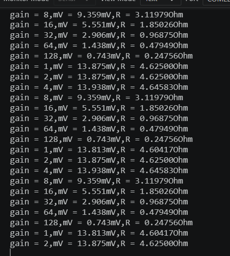
可以发现，增益超过4之后，结果就开始变得非常诡异，而这个芯片的增益切换逻辑正是在1，2，4倍时不启用PGA。。。。。。
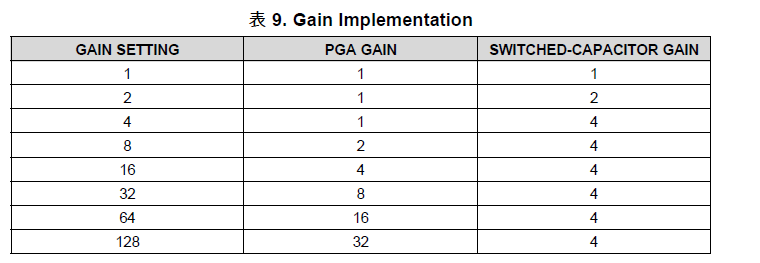

## 痛定思痛

想了很久，为什么增益这么奇怪，为什么测量值差这么多，终于，一个想法occurs to me：去看一下手册里PGA的框图和参数
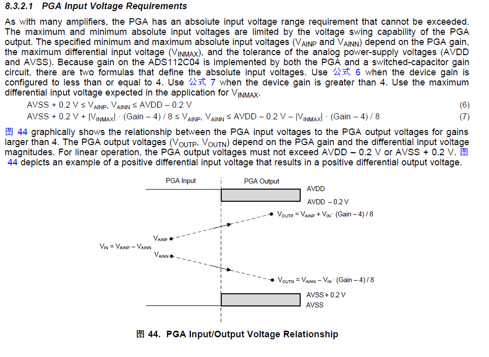
原来PGA是有一个输入电压范围的，共模电压太小或者太大，都会影响使用。刚才的电路，反相输入端相当于直接和VSS相同电位，难怪PGA工作不正常。然后我赶快做了下图的三个电路，得出了三种结果
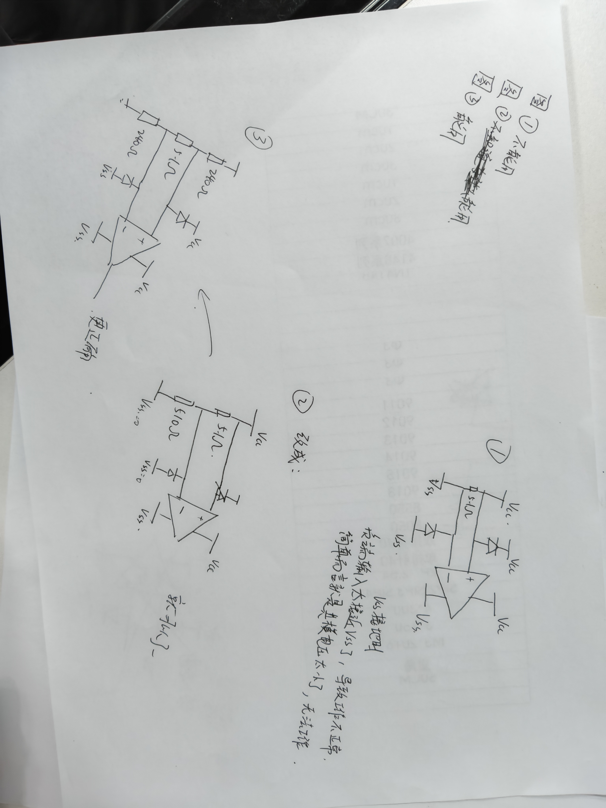
这是最后的简易测锡丝电路的实物图

下面是测量结果
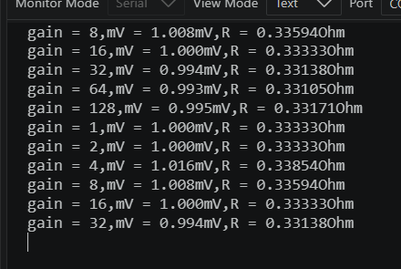

由于很多因素，我手上没有弄到六位半的万用表或者LCR做检查。不过锡丝这种软材质的导体，你掰一下电阻会变几十甚至上百mΩ，拿好仪器过来检查，也只能看个大概。我先拿了一个5.1欧姆的电阻测试了一下，相当准确。
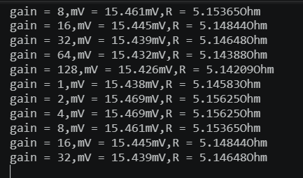
代码如下
```C
ADS112C_sendCommand(ADS112C_CMD_RESET);
delay_cycles(1000);
ADS112C_writeRegister(ADS112C_REG_CFG0,
    ADS112C_CFG0_MUX_AIN2_AIN3 |
    ADS112C_CFG0_GAIN_8 |
    ADS112C_CFG0_PGA_ENABLED);
ADS112C_writeRegister(ADS112C_REG_CFG1,
    ADS112C_CFG1_DR_20SPS |
    ADS112C_CFG1_MODE_TURBO |
    ADS112C_CFG1_CM_CONTINUOUS |
    ADS112C_CFG1_VREF_INTERNAL |
    ADS112C_CFG1_TS_DISABLE);
ADS112C_writeRegister(ADS112C_REG_CFG2,
    ADS112C_CFG2_DRDY_NO_DATA |
    ADS112C_CFG2_DCNT_DISABLE |
    ADS112C_CFG2_CRC_DISABLE |
    ADS112C_CFG2_BCS_OFF |
    ADS112C_CFG2_IDAC_1500UA);
ADS112C_writeRegister(ADS112C_REG_CFG3,
    ADS112C_CFG3_I1MUX_AIN0 |
    ADS112C_CFG3_I2MUX_AIN0);//两个电流源并联弄一个3mA的电流源
printf("Hello\n");
int16_t data16 = 0;
while (1) {
    for(uint16_t gain = 1;gain<=128;gain*=2){
        switch (gain)
        {
        case 1:
            ADS112C_configPGA(true, ADS112C_CFG0_GAIN_1);
            break;
        case 2:
            ADS112C_configPGA(true, ADS112C_CFG0_GAIN_2);
            break;
        case 4:
            ADS112C_configPGA(true, ADS112C_CFG0_GAIN_4);
            break;
        case 8:
            ADS112C_configPGA(true, ADS112C_CFG0_GAIN_8);
            break;
        case 16:
            ADS112C_configPGA(true, ADS112C_CFG0_GAIN_16);
            break;
        case 32:
            ADS112C_configPGA(true, ADS112C_CFG0_GAIN_32);
            break;
        case 64:
            ADS112C_configPGA(true, ADS112C_CFG0_GAIN_64);
            break;
        case 128:
            ADS112C_configPGA(true, ADS112C_CFG0_GAIN_128);
            break;
        default:
            break;
        }
        delay_cycles(16000000);
        data16 = ADS112C_readData();
        double mV = (double)data16 * 2.048 / 32768.0 * 1000.0 / gain;
        printf("gain = %d,", gain);
        printf("mV = %.3fmV,", mV);
        printf("R = %.5fOhm\n", mV/3.0);
    }
}
```
# 自校准

```C
ADS112C_configChannel(ADS112C_CFG0_MUX_MID_SUPPLY);
ADS112C_configPGA(true, ADS112C_CFG0_GAIN_128);
```
调用这两个函数，会变成差分输入接到(VCC- VSS)/2的地方，放大128倍，可以标定ADC本身的直流偏置，不过也没有多大了，我连去耦电容都没有
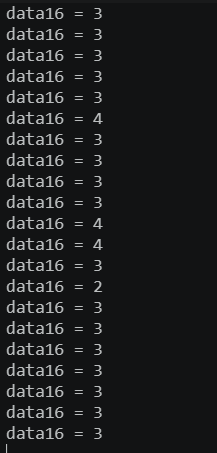
这个芯片的turbo模式下，采样率更高，对噪声的抑制效果更好

这个芯片我感兴趣的功能就这么多了，希望能给看到这篇文章的读者起到帮助!

---

**完整工程代码**: https://github.com/Kreeli/ADS112C04_Sn-s-resistance-measure